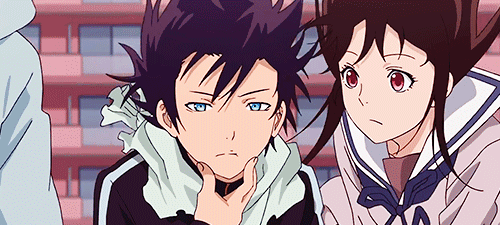

  

<h3 align="center" style="font-weight:600">

`aniavi`

</h3>

  Unsplash for Anime Avatars

---

## Getting Started

Add `https://aniavi.fiberjw.com/.netlify/functions/random` as the source to an image element/component in your app.

## Contributing

Submit a PR adding your square anime avatar file (as a `.png`) to the assets folder (preferably under the show's namespace) and add a link to it inside the `assets` array in `src/lambda/random.ts`.
